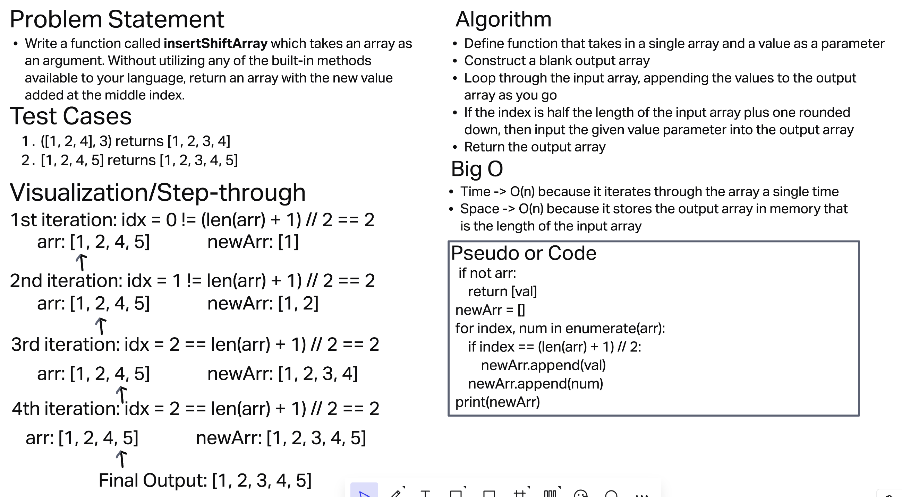

# Array Insert Shift - Insert to Middle of an Array
Write a function called insertShiftArray which takes in an array and a value to be added. Without utilizing any of the built-in methods available to your language, return an array with the new value added at the middle index. If their is an odd number pick the middle right spot.

## Whiteboard Process

## Approach & Efficiency
I chose the iterating for loop approach with O(n) efficiency becuase it was the simplest and most efficient manner to solve the problem. It also requires O(n) space because it constructs an additional array (list) of length "n"A
