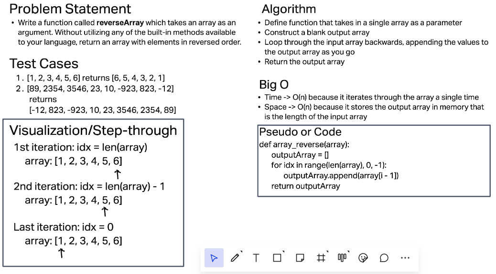

# Reverse of an Array

Write a function called *reverseArray* which takes an array as an argument. Without utilizing any of the built-in methods available to your language, return an array with elements in reversed order.

## Whiteboard Process

## Approach and Efficiency

I chose the iterating for loop approach with O(n) efficiency becuase it was the simplest and most efficient manner to solve the problem. At first, I solved it recursively but my recursive solution looked a little clunky. Although it was the same order of magnitude in efficiency and memory it required a few more steps and a little more memory to keep all the calls on the call stack.
