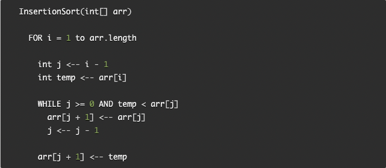
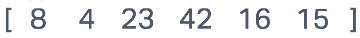
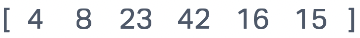
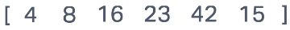
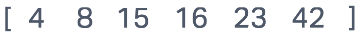

# Blog Notes: Insertion Sort

## Insertion Sort

Insertion sort is a sorting algorithm that traverses the array left to right and then for each traversal takes the value at the current index and swaps items moving left until the right item is no longer smaller than the left item in the comparison.

### Pseudocode

### Trace

Sample Array: `[8, 4, 23, 42, 16, 15]`

**Pass 1**

On Pass 1 the second element is swapped with the first element

**Pass 2**

On pass 2 the third element remains in it's correctly sorted place

**Pass 3**

On pass 3 the fourth element remains in it's correctly sorted place

**Pass 4**

On pass 4 the fifth element is slid down to the third spot by doing two swaps

**Pass 5**

On pass 5 the sixth element is slid down to the third spot by doing three swaps

### Efficiency

- Time: O(n^2)
  - The for every element in the array it performs an average of n/2 comparisons and swaps so more specifically O(n^2/2)
- Space: O(1)
  - The only additional space that must be allocated is a temp variable to hold a value during the swapping process.
