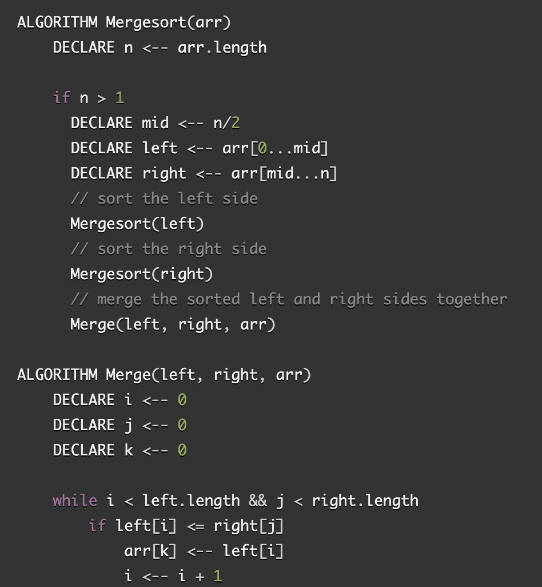
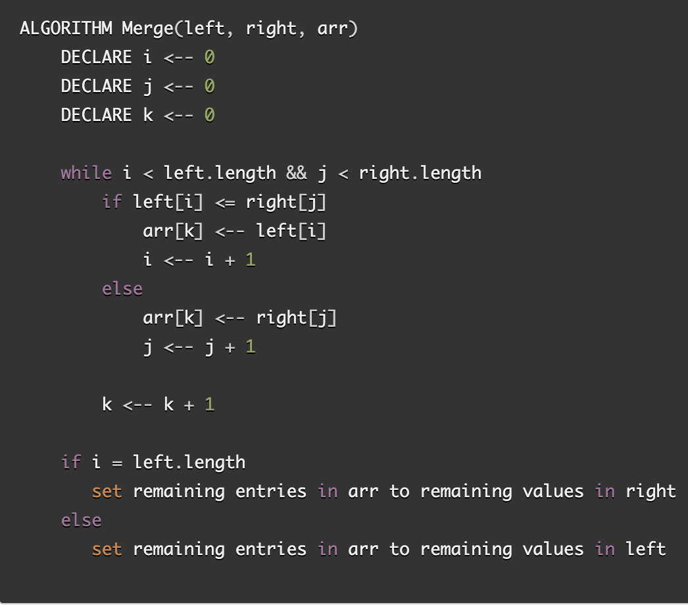
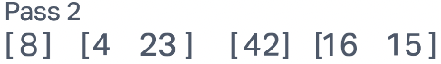
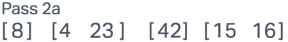
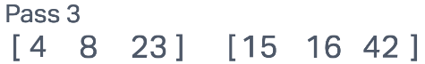
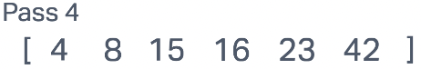

# Blog Notes: Merge Sort

## Merge Sort

Insertion sort is a sorting algorithm that employs to the divide and conquer method exploit the fact that sorting small lists and then merging these presorted lists runs drastically faster than sorting large amounts of random data at the same time.

[Insertion Sort](../../python/code_challenges/merge_sort.py)

### Pseudocode

### Trace

Sample Array: `[8, 4, 23, 42, 16, 15]`

**Pass 1**

**Pass 2**

**Pass 2a**

**Pass 3**

**Pass 4**

### Efficiency

- Time: O(n*log(n))
  - The for every element in the array it performs an average of n/2 comparisons and swaps so more specifically O(n^2/2)
- Space: O(n)
  - Because a stack of space 'n' is generated during the recursion to the base case

### Testing

[Testing File](../../python/tests/code_challenges/test_merge_sort.py)
